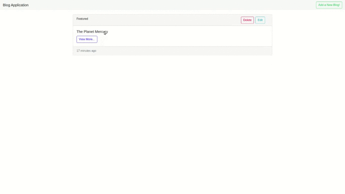

# Blog Application (ReactJs and Redux)

Using this application you can create, view and edit blogs. This application allows user to add blogs in markdown syntax to style the content of the blog. Using markdown syntax user can also add images/gifs urls to create impactful blogs

**Note**: This application requires [DRF backend server](https://github.com/ahmadx16/blog_app_server/tree/blog_server) running in the background to work properly. Learn about how to  setup and run backend [here](https://github.com/ahmadx16/blog_app_server/tree/blog_server)

## Technical Description
This application is built with [React](https://reactjs.org/) and context API. React helps creating reusable components quite easily that can be used across various projects.

On the index screen the user is shown the list of cards of blogs that were previously added and buttons to edit or delete them. On the navigation bar there is a button to add new blogs!


## Interface

It has a responsive interface styled with bootstrap!

### Demo


## Instructions

Following are the instructions that you need perform in order to run the application.

1. [Clone the repository](#clone-the-repository)
1. [Environment Setup](#environment-setup)
1. [Running the Application](#running-the-application)
1. [Troubleshooting](#troubleshooting)

## Clone the Repository

Clone this repository and switch to the `blog-app-react` branch as it currently contains the latest code. Run the following commands on your shell.

``` shell
git clone https://github.com/ahmadx16/blog_app_react.git
cd blog_app_react/
git checkout blog-app-react
``` 

The above commands will download the repository and switch the branch.

## Environment Setup

This application requires [Nodejs and npm](https://nodejs.org/en/) (npm now comes with node by default) installed on the system to execute. You can learn how to install on provided links. It is recommended to install latest version of node and npm. 
After you have installed node and npm run following command.

``` shell
npm install
```

This command will install all the packages that has been specified in `package.json` file.

## Running the Application

Run following command to start the application

``` shell
npm start
```

The above command will start the development server on `http://localhost:3000`

## Troubleshooting

Make sure [DRF backend server](https://github.com/ahmadx16/blog_app_server/tree/blog_server) is running in the background. 

On running command `npm start` you may or may not get the error `Error: ENOSPC: System limit for number of file watchers reached` . It occurs when system file watching limit exceeds. You can simply fix this error either by using command `sudo npm start` or increasing the file watchers limit. Learn about how to increase file watchers on Ubuntu [here](https://stackoverflow.com/questions/55763428/react-native-error-enospc-system-limit-for-number-of-file-watchers-reached)


___
This project was bootstrapped with [Create React App](https://github.com/facebook/create-react-app).
